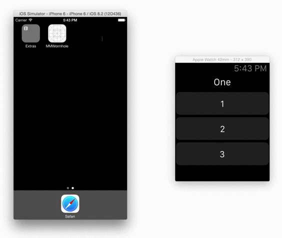

# MMWormhole

MMWormhole creates a bridge between an iOS or OS X extension and its containing application. The wormhole is meant to be used to pass data or commands back and forth between the two locations. Messages are archived to files which are written to the application's shared App Group. The effect closely resembles interprocess communication between the app and the extension, though true interprocess communication does not exist between extensions and containing apps. 

The wormhole also supports CFNotificationCenter Darwin Notifications in an effort to support realtime change notifications. When a message is passed to the wormhole, interested parties can listen and be notified of these changes on either side of the wormhole. The effect is nearly instant updates on either side when a message is sent through the wormhole.

<p align="center">

</p>

## Example

```objective-c
[self.wormhole passMessageObject:@{@"buttonNumber" : @(1)} identifier:@"button"];

[self.wormhole listenForMessageWithIdentifier:@"button" 
  listener:^(id messageObject) {
    self.numberLabel.text = [messageObject[@"buttonNumber"] stringValue];
}];
```

## Getting Started

- Install MMWormhole via CocoaPods or by downloading the Source files
- [Configure your App and Extension to support App Groups](https://developer.apple.com/library/ios/documentation/General/Conceptual/ExtensibilityPG/ExtensionScenarios.html)
- Begin using MMWormhole to pass messages between your App and Extension

### Note

The MMWormhole Example app will only work with your shared App Group identifiers and Entitlements and is meant purely for reference

---
##Installing MMWormhole
<br/>
You can install Wormhole in your project by using [CocoaPods](https://github.com/cocoapods/cocoapods):

```Ruby
pod 'MMWormhole', '~> 1.2.0'
```

[](https://github.com/Carthage/Carthage)<br/>
MMWormhole also supports Carthage.

## Overview

MMWormhole is designed to make it easy to share very basic information and commands between an extension and it's containing application. The wormhole should remain stable whether the containing app is running or not, but notifications will only be triggered in the containing app if the app is awake in the background. This makes MMWormhole ideal for cases where the containing app is already running via some form of background modes. 

A good way to think of the wormhole is a collection of shared mailboxes. An identifier is essentially a unique mailbox you can send messages to. You know where a message will be delivered to because of the identifier you associate with it, but not necessarily when the message will be picked up by the recipient. If the app or extension are in the background, they may not receive the message immediately. By convention, sending messages should be done from one side to another, not necessarily from yourself to yourself. It's also a good practice to check the contents of your mailbox when your app or extension wakes up, in case any messages have been left there while you were away.

MMWormhole uses NSKeyedArchiver as a serialization medium, so any object that is NSCoding compliant can work as a message. For many apps, sharing simple strings, numbers, or JSON objects is sufficient to drive the UI of a Widget or Apple Watch app. Messages can be sent and persisted easily as archive files and read later when the app or extension is woken up later.

Using MMWormhole is extremely straightforward. The only real catch is that your app and it's extensions must support shared app groups. The group will be used for writing the archive files that represent each message. While larger files and structures, including a whole Core Data database, can be shared using App Groups, MMWormhole is designed to use it's own directory simply to pass messages. Because of that, a best practice is to initialize MMWormhole with a directory name that it will use within your app's shared App Group.

### Initialization

Initialize MMWormhole with your App Group identifier and an optional directory name

Objective-C:
```objective-c
self.wormhole = [[MMWormhole alloc] initWithApplicationGroupIdentifier:@"group.com.mutualmobile.wormhole"
                                                     optionalDirectory:@"wormhole"];
```
Swift:
```swift
let wormhole = MMWormhole(applicationGroupIdentifier: "group.com.mutualmobile.wormhole", optionalDirectory: "wormhole")
```

### Passing a Message

Pass a message with an identifier for the message and a NSCoding compliant object as the message itself

Objective-C:
```objective-c
[self.wormhole passMessageObject:@{@"titleString" : title} 
                      identifier:@"messageIdentifier"];
```
Swift:
```swift
wormhole.passMessageObject("titleString", identifier: "messageIdentifier")
```

### Reading a Message

You have two options for reading a message. You can obtain the message for an identifier at any time by asking the wormhole for the message. 

Objective-C:
```objective-c
id messageObject = [self.wormhole messageWithIdentifier:@"messageIdentifier"];
```

You can also listen for changes to that message and be notified when that message is updated.

Objective-C:
```objective-c
[self.wormhole listenForMessageWithIdentifier:@"messageIdentifier" 
 listener:^(id messageObject) {
    // Do Something
}];

```
Swift:
```swift
wormhole.listenForMessageWithIdentifier("messageIdentifier", listener: { (messageObject) -> Void in
    if let message: AnyObject = messageObject {
        // Do something
    }
})
```


### Designing Your Communication Scheme

You can think of message passing between apps and extensions sort of like a web service. The web service has endpoints that you can read and write. The message identifiers for your MMWormhole messages can be thought of in much the same way. A great practice is to design very clear message identifiers so that you immediately know when reading your code who sent the message and why, and what the possible contents of the message might be. Just like you would design a web service with clear semantics, you should do the same with your wormhole messaging scheme.


## Requirements

MMWormhole requires iOS 7.0 or higher or OS X 10.10 or higher.

## Troubleshooting

If messages are not received on the other end, check Project->Capabilities->App Groups.<br/>
Three checkmarks should be displayed in the steps section.

<p align="center">

</p>

<p align="center">

</p>

## Credits

MMWormhole was created by [Conrad Stoll](http://conradstoll.com) at [Mutual Mobile](http://www.mutualmobile.com).

Credit also to [Wade Spires](https://devforums.apple.com/people/mindsaspire), [Tom Harrington](https://twitter.com/atomicbird), and [Rene Cacheaux](https://twitter.com/rcachatx) for work and inspiration surrounding notifications between the containing app and it's extensions.

## License

MMWormhole is available under the MIT license. See the LICENSE file for more info.
